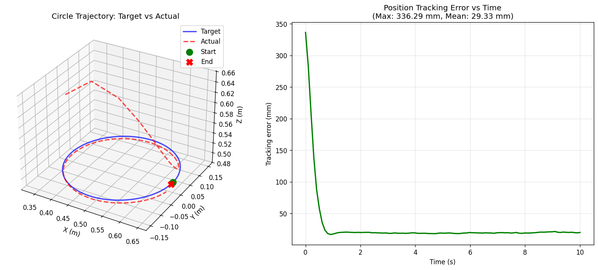
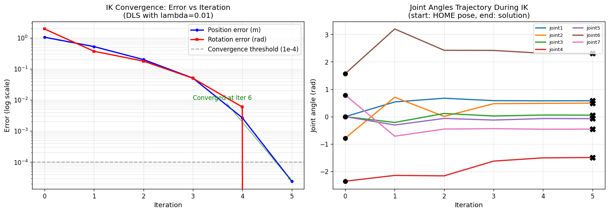
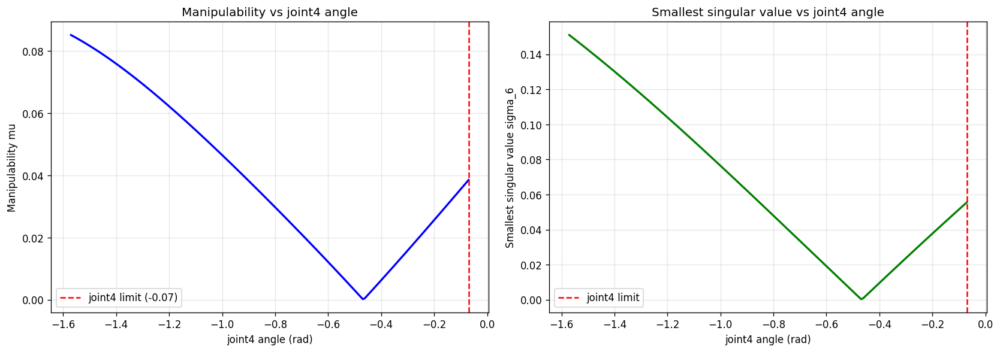
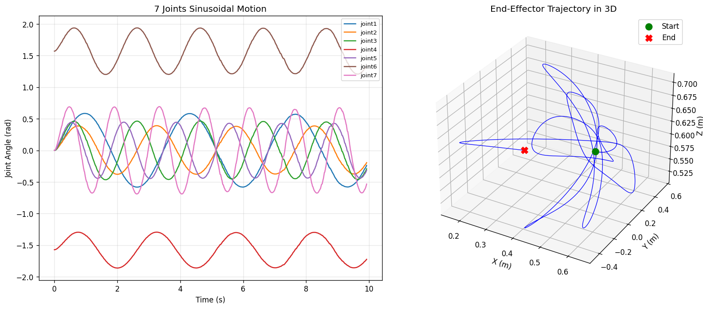

# MuJoCo Panda Control

基于 MuJoCo 的 7-DoF Franka Emika Panda 机械臂全栈控制系统。从运动学、动力学建模出发，逐步实现关节空间控制、任务空间控制、轨迹规划、模型预测控制（MPC）等核心算法，最终结合具身智能方向（Diffusion Policy / 模仿学习）。

## 演示

### Week 1：运动学三件套 + 圆轨迹跟踪

末端在 XY 平面跟踪 0.15m 半径的圆形轨迹（10 秒一周）：



视频效果：[`logs/day7_circle_demo.mp4`](logs/day7_circle_demo.mp4)（点击下载）

### IK 收敛特性（Day 6）

DLS 逆运动学在 6 次迭代内达到 24 微米精度：



### 奇异位形分析（Day 5）

扫描 Panda joint4 观察可操作度 μ 变化：



### 关节空间运动（Day 2）

7 个关节按不同频率/振幅的正弦运动，末端在三维空间画出复杂闭合轨迹：



## 关键指标（Week 1）

| 模块 | 精度 | 验证方法 |
|------|------|---------|
| 正运动学 (POE) | < 1e-7 | 100 随机位形 vs MuJoCo |
| 雅可比矩阵 | 1e-15（机器精度）| 100 随机位形 vs MuJoCo |
| 逆运动学 (DLS) | 0.34 mm | 97% 成功率（含随机重启）|
| 圆轨迹跟踪 | 20 mm 稳态 | MuJoCo 默认位置伺服 |

## 技术栈

- **数学基础**: Modern Robotics（POE 公式、SE(3) 李代数、DLS）
- **仿真引擎**: MuJoCo 3.7
- **可视化**: Matplotlib, MuJoCo Viewer, ImageIO (MP4 离屏渲染)
- **核心库**: NumPy, SciPy
- **测试框架**: 自定义单元测试 + 与 MuJoCo 对照验证
- **开发环境**: Ubuntu 24.04 (WSL2) + VS Code Remote


## 项目结构
```
mujoco-panda-control/
├── assets/
│   └── mujoco_menagerie/        # DeepMind 机器人模型库（git 忽略）
├── src/
│   ├── kinematics/              # 运动学：FK / Jacobian / IK
│   ├── controllers/             # 控制器：PD / CTC / 阻抗控制 / MPC
│   └── utils/                   # 工具函数
├── scripts/                     # 演示脚本
│   ├── 01_hello_mujoco.py       # 双摆 hello world
│   ├── 02_explore_panda.py      # 探索 Panda 模型结构
│   ├── 03_interactive_panda.py  # 关节扫描可视化
│   ├── 04_panda_sine_motion.py  # 7 关节正弦运动
│   └── 05_record_video.py       # 录制 MP4 视频
├── logs/                        # 学习日志、效果图、视频
├── requirements.txt
├── .gitignore
└── README.md
```
## 进度

### Week 1: 运动学（已完成 ✅）
- [x] Day 1: 环境搭建（WSL2 + MuJoCo）
- [x] Day 2: 加载 Franka Panda + 关节扫描 + 视频
- [x] Day 3: SO(3) / SE(3) 变换 + 单元测试
- [x] Day 4: 正运动学（POE）
- [x] Day 5: 雅可比矩阵 + 奇异性分析
- [x] Day 6: 逆运动学（DLS）
- [x] Day 7: 圆轨迹跟踪综合演示

### Week 2: 动力学 + 控制器（进行中）
- [ ] Day 8-9: 动力学（M(q), C(q,q̇), G(q)）
- [ ] Day 10: PD + 重力补偿
- [ ] Day 11: 计算力矩控制 (CTC)
- [ ] Day 12: 任务空间阻抗控制
- [ ] Day 13: 4 种控制器综合对比
- [ ] Day 14: Week 2 总结

### Week 3: 轨迹规划 + MPC（待定）
### Week 4: 具身智能（模仿学习 / Diffusion Policy）（待定）

## 快速开始

```bash
git clone https://github.com/dichen-star/mujoco-panda-control.git
cd mujoco-panda-control

conda create -n robot python=3.10 -y
conda activate robot
pip install -r requirements.txt

mkdir -p assets && cd assets
git clone https://gh-proxy.com/https://github.com/google-deepmind/mujoco_menagerie.git
cd ..

# 看 Week 1 终极演示
python scripts/09_circle_tracking_offline.py
```

## 参考资料

- Lynch & Park, *Modern Robotics: Mechanics, Planning, and Control*
- DeepMind MuJoCo: https://github.com/google-deepmind/mujoco_menagerie
- Franka Emika Panda 官方文档

## License

MIT

