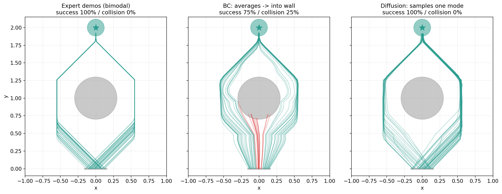
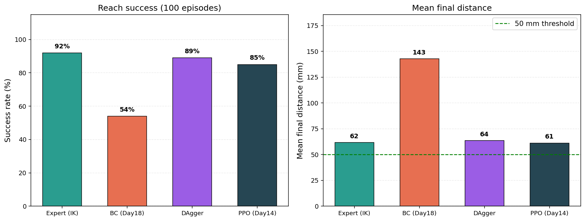

# MuJoCo Franka Panda 控制与学习全栈

> 从运动学、动力学控制，到强化学习与现代模仿学习 —— 一条贯穿具身智能的完整技术栈。
> 每个方法都配有可复现代码、真实实验数字，以及"为什么 work / 为什么不 work"的诊断分析。



*多模态绕障：向左绕、向右绕都对。行为克隆（BC）把两条等价路径平均成"直行撞墙"（25% 碰撞）；Diffusion Policy + 动作分块从分布里采样一条连贯路径，干净二选一（0 碰撞）。*

---

## TL;DR

4 周、22 个主题，在 MuJoCo 里用 Franka Panda 从零实现并对比了机器人"如何动起来"的四个层次：
**运动学 → 动力学控制 → 强化学习 → 模仿学习**。

不只是"训了一个能跑的策略"，而是在每一层都追问方法的能力边界。两个值得一看的洞察：

- **sim-to-real 的鲁棒性 gap 取决于动作空间。** 位置控制的内部 PD 伺服会吸收域随机化（DR）的扰动，使 DR 看起来"没用"（86% vs 88%）；切到力矩控制，扰动才暴露出来，DR 把最坏情况成功率从 **8% 拉到 26%**。
- **Diffusion Policy 解决的是多模态，不是协变量偏移。** 单模态 reach 任务上它与 BC 持平（~50%）；多模态绕障任务上它把碰撞率从 **25%（BC）降到 0%**。

---

## 成绩一览

| 周 | 主题 | 关键结果 |
|---|---|---|
| **W1** | 运动学（FK / IK） | 解析正/逆运动学，作为控制与示范采集的几何基础 |
| **W2** | 动力学控制 | 计算力矩控制（CTC）末端跟踪 **0.13 mm**、PD+重力 0.23 mm；阻抗控制呈胡克定律柔顺 |
| **W3** | 强化学习（PPO + DR） | PPO reach ~82%；力矩控制下 DR 将最坏情况 **8% → 26%**；揭示 sim-to-real gap 与动作空间的关系 |
| **W4** | 模仿学习（BC / DAgger / DP） | DAgger 一次迭代 **56% → 90%**；多模态任务 Diffusion Policy 碰撞率 **25% → 0%** |

---

## 技术栈

- **仿真**：MuJoCo + [mujoco_menagerie](https://github.com/google-deepmind/mujoco_menagerie)（Franka Emika Panda）
- **基于模型的控制**：PD + 重力补偿 / 计算力矩控制（CTC）/ 阻抗控制
- **强化学习**：Stable-Baselines3（PPO）、Gymnasium 自建环境、域随机化（位置控制 vs 力矩控制 ablation）
- **模仿学习**：**从零实现** Behavioral Cloning、DAgger、Diffusion Policy（条件 DDPM）+ 动作分块
- **语言 / 库**：Python 3.10, PyTorch, NumPy, Matplotlib

---

## 亮点结果

**三范式大对比（Week 3）** —— CTC / PPO（位置）/ PPO（力矩 + DR）在同一 reach 任务上的精度与鲁棒性：


结论：没有银弹。任务定义清晰时不同范式会收敛到同一天花板，差别在代价与假设（模型需求、奖励设计、训练成本）。

**DAgger 修复协变量偏移（Week 4）** —— 一次迭代从 56% 升到 90%，且 val MSE 几乎不动（分布 ≫ 数量）：



---

## 仓库结构

```
mujoco-panda-control/
├── assets/mujoco_menagerie/franka_emika_panda/   # Panda MJCF 模型
├── src/
│   ├── kinematics/      # forward.py (FK), inverse.py (IK)
│   ├── controllers/     # pd_gravity.py, ctc.py, impedance.py
│   ├── envs/            # panda_reach_env*.py, obstacle2d_env.py, curriculum_callback.py
│   └── imitation/       # bc_policy.py, diffusion_policy.py  (均为从零实现)
├── scripts/             # 编号脚本：采集 / 训练 / 评估 / 对比 (15–36)
├── models/              # 训练好的策略 (.zip = SB3, .pt = torch)
├── data/                # 专家示范 (.npz)
├── logs/                # 每日实验日志 + 结果图
└── docs/                # 每周总结博客 + 项目叙事
```

---

## 环境配置

```bash
conda create -n robot python=3.10 -y
conda activate robot
pip install mujoco gymnasium stable-baselines3 torch numpy matplotlib

# Panda 模型（首次运行前）
git clone https://github.com/google-deepmind/mujoco_menagerie assets/mujoco_menagerie
```

---

## 快速复现

```bash
# Week 2 —— 四种控制器对比（CTC / PD+重力 / 阻抗）
python scripts/15_controller_comparison.py

# Week 3 —— 三范式大对比（CTC / PPO位置 / PPO力矩+DR）
python scripts/26_grand_comparison.py

# Week 4 —— 模仿学习多模态对决（BC vs Diffusion Policy）★ 项目门面
python scripts/34_collect_obstacle_demos.py   # 采集双模态示范
python scripts/35_train_obstacle.py           # 训练 chunked BC + chunked DP
python scripts/36_compare_obstacle.py         # 生成上方 hero 图
```

> 全部任务在 CPU 上即可运行（toy-scale）；有 GPU 时 Diffusion Policy 训练会更快。

---

## 详细记录

- 项目叙事 / 面试讲法：[`docs/project_narrative.md`](docs/project_narrative.md)
- 每周博客：[Week 1 运动学](docs/week1_summary.md) · [Week 2 控制](docs/week2_summary.md) · [Week 3 强化学习](docs/week3_summary.md) · [Week 4 模仿学习](docs/week4_summary.md)
- 每日实验日志（含失败与根因）：`logs/dayNN.md`

---

*这是一个学习型作品集项目，任务为仿真中的 toy-scale reach / 导航。重点不在覆盖面，而在对每个方法能力边界的诊断式理解。*