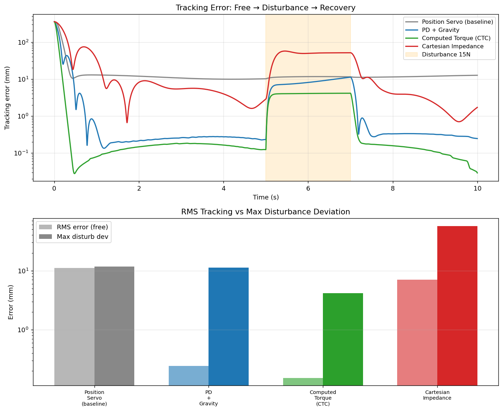

# Week 2：从动力学到四种控制器，5 天闭环

## 总览

5 天闭环跑完机器人控制经典四件套：

- Day 8: 动力学方程 M(q)q̈ + C(q,q̇)q̇ + G(q) = τ 的提取
- Day 9: PD + 重力补偿 → 0.23mm
- Day 10: 计算力矩控制 CTC → 0.13mm
- Day 11: 笛卡尔阻抗控制（胡克定律误差 1%）
- Day 12: 4 控制器同台对比 + 周总结

所有控制律手写实现，MuJoCo + Franka Panda 真实物理仿真验证，每条结论都有数据。

## 一图看懂

实测数据（同一圆轨迹 + 5–7s 施加 15N 横向扰动）：

| 控制器 | 跟踪 RMS | 扰动期偏移 | 恢复时间 |
|--------|---------|-----------|---------|
| Position Servo    | 11.053mm | 11.7mm | 未恢复 |
| PD + 重力补偿     |  0.244mm | 11.3mm | 0.14s |
| 计算力矩 CTC      |  0.153mm |  4.1mm | 0.06s |
| 笛卡尔阻抗        |  7.060mm | 57.1mm | 2.05s |

## 读图三句话

1. **自由跟踪精度**：CTC > PD+G >> 阻抗 >> 伺服。CTC 把动力学非线性全抵消，剩下的只是数值误差。
2. **扰动响应**：CTC 硬扛（4mm），阻抗柔顺退让（57mm）——后者不是输了，是设计目标。
3. **57mm 不是 bug 是 feature**：F = K·Δx → 15 / 300 = 50mm，胡克定律预测，仿真验证。

## 我踩过的坑（这部分面试最爱问）

### 1. 重力补偿 vs 完整 bias

阻抗控制只补偿 G(q)：
τ = J^T · F_imp + G(q)

CTC 补偿完整 bias（含 Coriolis 和重力）：
τ = M(q) · q̈_d + bias    # bias = C·q̇ + G

记错了就会出现"低速没问题、高速发散"的诡异现象。

### 2. 雅可比约定混淆

教科书的 6×n 雅可比 [Jv; Jω] 是一个约定，MuJoCo 的 mj_jac 返回 3×n 平动 + 3×n 转动是另一个约定。
**工程优先用框架自己的 API**，不要硬套教科书公式。

### 3. Actuator 力矩源冲突（项目最大坑）

MuJoCo 内置位置伺服用 data.ctrl，自定义力矩控制用 data.qfrc_applied。
两者并存时**会叠加而非替换**——所以自定义控制器必须先调 disable_actuators。
同一个 model 也不能同时跑两种范式，Day 12 这个对比脚本必须为每个控制器重新加载全新 model。

### 4. 稳态指标必须跳启动瞬态

Day 12 首跑全程 RMS 都几十毫米，把 CTC 的 0.15mm 精度埋没。
原因：末端起点 ≠ 轨迹起点，启动有几百毫米飞移。
**任何精度指标都要明确"从哪一时刻开始算"**，写论文时务必标清窗口。

## 四控制器选型

| 场景 | 推荐 | 原因 |
|------|------|------|
| 高精度轨迹（焊接、装配） | CTC | 动力学完全补偿，亚毫米精度 |
| 通用伺服 | PD + 重力补偿 | 简单、稳定、足够好 |
| 人机协作、接触任务 | 阻抗 | 柔顺退让 = 内在安全 |
| 简单到点 | 位置伺服 | 一行 ctrl，省心 |

阻抗的 K 是一个**可调旋钮**，设计者根据任务在"精度"和"柔顺"之间显式权衡——这是协作机器人安全性的来源。

## 下一站

Week 3：强化学习。和 Week 1–2 的"白盒模型驱动"完全相反——不依赖 M, C, G，让机械臂自己学。