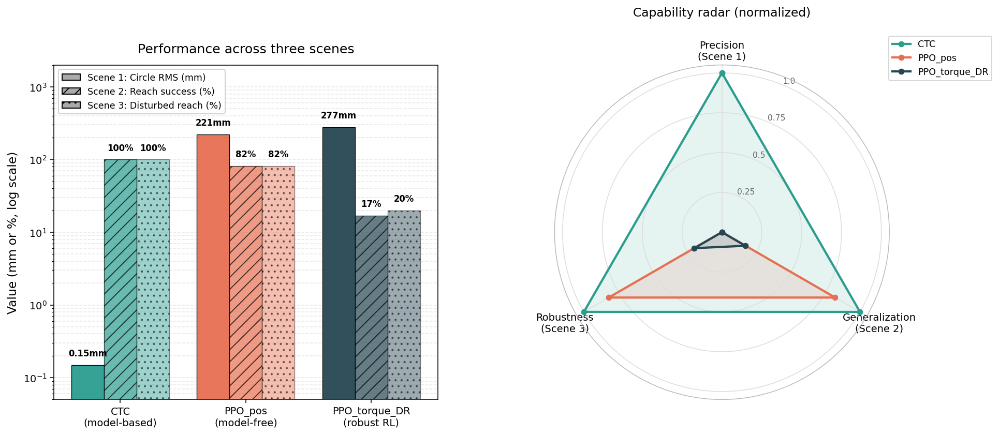

# Week 3 总结:从控制论到强化学习,与跨范式对决

## 项目背景

`mujoco-panda-control` 是一个为期数周的个人项目,以 MuJoCo 与 Franka Panda 为载体,
系统实现机器人运动学、动力学、控制器、与强化学习的全栈代码。Week 2 已闭环动力学建模与
四种经典控制器(PD+G / CTC / 阻抗 / 综合对比)。Week 3 转向强化学习范式,并在最后一日
将所有方法置于同一评估框架下进行跨范式对比。

## 路线图

| Day | 主题 | 核心交付 |
|---|---|---|
| 13 | Gymnasium 环境封装 | 23-dim 观测 / 7-dim 动作 / dense reward 的 reach 任务 |
| 14 | PPO 训练 | 250k 步 81% 成功率,与 IK oracle 平均误差持平(65 mm) |
| 15 | 奖励工程与课程学习 | sparse reward 完全失败的对照数据;curriculum 实现细节失败的诊断 |
| 16 | Domain Randomization | "位置控制 DR 几乎无效 → 力矩控制 DR worst case 救援 8%→26%" 的实验闭环 |
| 17 | 三方对决 | model-based / model-free / robust RL 的能力雷达图与选型决策树 |

## 三方对决:方法、场景、数据

三种代表性方法分别对应过去三十年机器人控制范式的演化:

- **CTC**:基于完整动力学 M(q)q̈ + C(q,q̇)q̇ + G(q) = τ 的反馈线性化,model-based 的代表。
- **PPO_pos**:位置增量动作空间的 model-free RL,内置 PD 伺服执行,2017 年深度 RL 的代表。
- **PPO_torque_DR**:力矩动作空间 + 4 维域随机化训练,robust RL 的代表,对应 OpenAI 2019 年解魔方的核心思路。

三个场景分别对应三种能力:

- **Scene 1**:半径 0.15 m / 周期 10 s 圆轨迹跟踪 → 测精度
- **Scene 2**:100 个随机目标 reach,5cm 阈值 → 测泛化
- **Scene 3**:Scene 2 + worst-case 扰动(payload +0.4kg,damping ×1.25,gravity ×1.05) → 测鲁棒性

实测结果:

| 方法 | Scene 1 RMS (mm) | Scene 2 成功率 | Scene 3 成功率 |
|---|---|---|---|
| CTC | 0.148 | 100% | 100% |
| PPO_pos | 220.7 | 82% | 82% |
| PPO_torque_DR | 277.5 | 17% | 20% |

## 结果解读

**CTC 三场景全优,但这不是"普适最优"的证据。** 它的优势成立的前提是动力学模型精确、
目标可由 IK 求解、执行环境与训练环境一致。一旦其中任一条件不满足(动力学失配、接触丰富、
真机参数漂移),CTC 的精度优势会迅速消失,而 RL 方法的相对位置会改变。

**PPO_pos 的 82% 与 IK oracle 持平,印证 model-free 在合适任务上的实用性。** Day 14 中
对照实验显示其平均终末距离(65 mm)与基于 IK 的 oracle 策略一致——神经网络在不接触任何
动力学先验的前提下,学到了与 model-based 方案等效的执行精度。代价是 Scene 1 上的任务迁移失败
(220 mm),即学到的策略不能直接迁移到训练分布外的任务形态。

**PPO_torque_DR 绝对值最低但 Scene 3 相对 Scene 2 提升 3 个百分点。** 这反映该方法的定位:
绝对精度受限于力矩 RL 的学习难度,价值在于扰动场景下的相对鲁棒性。Day 16 的对照数据更直接:
worst case 下 DR 模型将成功率从标称模型的 8% 提升至 26%(3.25 倍),damping 偏移下从 4% 提升至 26%
(6.5 倍)。

## Week 3 中两个值得记录的工程经验

**一,RL 训练的非线性收敛要求"等待至临界点"的工程判断力。**
Day 14 PPO 训练前 100k 步的 eval 成功率持续为 0,曲线毫无信号。150k 步后进入挣扎期,
200k 步突破至 30%,250k 步达到 1.0。这与监督学习的单调下降 loss 截然不同。一个常见的失败模式
是工程师在 50k 步看到曲线趴平就放弃训练——而那往往恰好是突破前一秒。判断 RL 训练是否健康
需要看更细的指标:`explained_variance`(critic 拟合度)、`clip_fraction`(策略更新强度)、
`eval` 与 `rollout` 成功率之差(策略成熟度),这些指标会比 mean reward 更早预示成功。

**二,sim-to-real gap 受动作空间影响,而非仅取决于参数偏差。**
Day 16 中,位置控制版的 DR 训练几乎没有效果(标称 86% vs DR 88%,差异在噪声范围内)。
诊断过程:位置控制下,agent 输出的是关节角目标,实际执行的是 MuJoCo 内置 PD 位置伺服。
PD 伺服天生对动力学扰动鲁棒——加 0.3 kg 负载?自动加大力矩使关节到位。扰动在 agent 看到之前
就被吸收了,DR 没有作用对象。重做力矩控制版后,agent 必须自己算出对抗负载与阻尼的力矩,
动力学直接暴露,DR 的效果立刻显现:worst case 从 8% 救到 26%。这一结论同时解释了一个长期被
忽视的工程现象:工业位置控制机械臂的 sim-to-real 难度,远低于教科书暗示的水平。

## 工程选型决策

| 任务特征 | 推荐范式 |
|---|---|
| 动力学可精确建模,目标可由 IK 求解(焊接、装配) | CTC / 计算力矩控制 |
| 目标随机或语义化,任务多变 | model-free RL (PPO/SAC) |
| 接触丰富 / 真机部署 / 参数漂移 | DR + 力矩控制 RL |
| 接触柔顺 / 人机协作 | 阻抗控制 |
| 多约束最优化 / 预测窗口需求 | MPC |

选型本质上是任务对"精度 / 泛化 / 鲁棒性"三者优先级的判断,以及动力学可建模程度的判断。
**不存在普适最优方法**;期望单一范式覆盖所有场景,是项目失败的常见起点。

## 仓库

代码、日志、对比图全部开源于 GitHub。每日实验数据、踩坑记录、训练曲线均完整保留,
便于复现与扩展。

## 下一阶段

Week 4 候选方向为接触任务深耕(peg-in-hole / 拧螺丝,综合阻抗与 RL)或模仿学习
(Diffusion Policy / ACT)。前者面向协作机械臂与装配机器人岗位,后者面向具身智能赛道。
两条路线特征差异较大,选型将基于求职目标进一步确定。